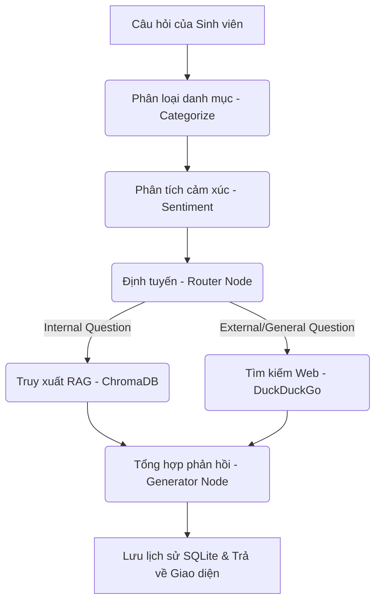

# 🤖 Hệ Thống Chatbot AI Tư Vấn Cho Sinh Viên Ngành Công Nghệ Thông Tin (IT Mentor)

Hệ thống Chatbot AI được thiết kế chuyên biệt để hỗ trợ, tư vấn và hướng dẫn sinh viên ngành Công nghệ Thông tin (CNTT). Hệ thống kết hợp công nghệ **RAG (Retrieval-Augmented Generation)** cục bộ và quy trình điều phối **LangGraph** thông minh giúp đưa ra câu trả lời chính xác dựa trên dữ liệu nội bộ của nhà trường kết hợp tìm kiếm thông tin thời thực trên Web.

---

## ✨ Các Tính Năng Nổi Bật

1. **📚 Hệ Tri Thức RAG Cục Bộ (Local RAG)**
   - Sử dụng mô hình cục bộ **`keepitreal/vietnamese-sbert`** để tạo vector lưu vào cơ sở dữ liệu **ChromaDB**.
   - Không giới hạn số lần gọi, miễn phí 100%, chạy offline và bảo mật thông tin tối đa.
   - Hỗ trợ giải đáp chính xác về quy chế đào tạo, chương trình khung đào tạo, danh sách giảng viên, lịch học phí.

2. **🌐 Tìm Kiếm Web Thời Gian Thực (Async Web Search)**
   - Tích hợp công cụ tìm kiếm DuckDuckGo và cơ chế cào dữ liệu bất đồng bộ (`httpx` + `BeautifulSoup`).
   - Tự động tìm kiếm và tổng hợp thông tin khi sinh viên hỏi về các kiến thức mới, xu hướng CNTT hiện tại (ví dụ: công nghệ nổi bật năm 2025, thông tin giảng viên cập nhật...).

3. **👁️ Phân Tích Hình Ảnh (Gemini Vision)**
   - Cho phép sinh viên tải lên hình ảnh (ảnh chụp lỗi code, ảnh chụp bảng điểm, thời khóa biểu).
   - Tự động trích xuất thông tin từ ảnh và đưa vào ngữ cảnh của chatbot để trả lời thắc mắc.

4. **💾 Lưu Trữ Lịch Sử Chat Lâu Dài (SQLite)**
   - Sử dụng database **SQLite (`chat_history.db`)** để tự động lưu lịch sử hội thoại của từng sinh viên dựa trên `session_id`.
   - Lịch sử tự động được khôi phục khi sinh viên F5 hoặc tải lại trình duyệt.

5. **🎨 Giao Diện Web Đẹp & Trực Quan (PrismJS)**
   - Thiết kế giao diện hiện đại với Dark Mode cao cấp.
   - Tích hợp thư viện **PrismJS** giúp tô màu cú pháp mã nguồn (Syntax Highlighting) chuyên nghiệp và hỗ trợ nút "Copy" nhanh tiện lợi cho sinh viên khi hỏi code.

---

## 🛠️ Kiến Trúc Hệ Thống (Workflow)

Hệ thống được điều phối qua một quy trình trạng thái (StateGraph) của LangGraph gồm các bước:



---

## 📁 Cấu Trúc Thư Mục Dự Án

```text
GenAI_Agents-main/
├── backend/               # Thư mục chứa mã nguồn Backend
│   ├── app.py             # Backend API (FastAPI) & LangGraph Agent Workflow
│   └── ingest.py          # Pipeline đọc, cắt và nạp tài liệu vào ChromaDB
├── database/              # Thư mục chứa các cơ sở dữ liệu
│   ├── chroma_db/         # Cơ sở dữ liệu Vector lưu trữ tài liệu đã nhúng
│   └── chat_history.db    # Cơ sở dữ liệu SQLite lưu lịch sử trò chuyện
├── data/                  # Thư mục chứa tài liệu tri thức (PDF, TXT, MD)
├── static/                # Giao diện Web (HTML, CSS, JS)
│   ├── index.html
│   ├── style.css
│   └── script.js
├── .env                   # Tệp cấu hình chứa API Key (được bỏ qua trong git)
└── requirements.txt       # Danh sách các thư viện Python cần cài đặt
```

---

## 🚀 Hướng Dẫn Chạy Dự Án

### 1. Cài đặt môi trường
Đảm bảo máy tính đã cài đặt Python 3.10 trở lên. Cài đặt các thư viện cần thiết:
```bash
pip install -r requirements.txt
```

### 2. Cấu hình khóa API
Tạo tệp `.env` ở thư mục gốc của dự án với nội dung:
```env
GOOGLE_API_KEY=your_gemini_api_key_here
```

### 3. Nạp tài liệu tri thức vào Database
Đặt các tài liệu liên quan đến trường học, chương trình đào tạo của ngành CNTT dưới dạng PDF hoặc TXT vào thư mục `data/`. Sau đó chạy lệnh nạp dữ liệu:
```bash
python backend/ingest.py
```

### 4. Khởi động Chatbot
Khởi động server FastAPI:
```bash
python backend/app.py
```
Mở trình duyệt và truy cập: **`http://localhost:8004`** để bắt đầu trò chuyện cùng AI Mentor!

